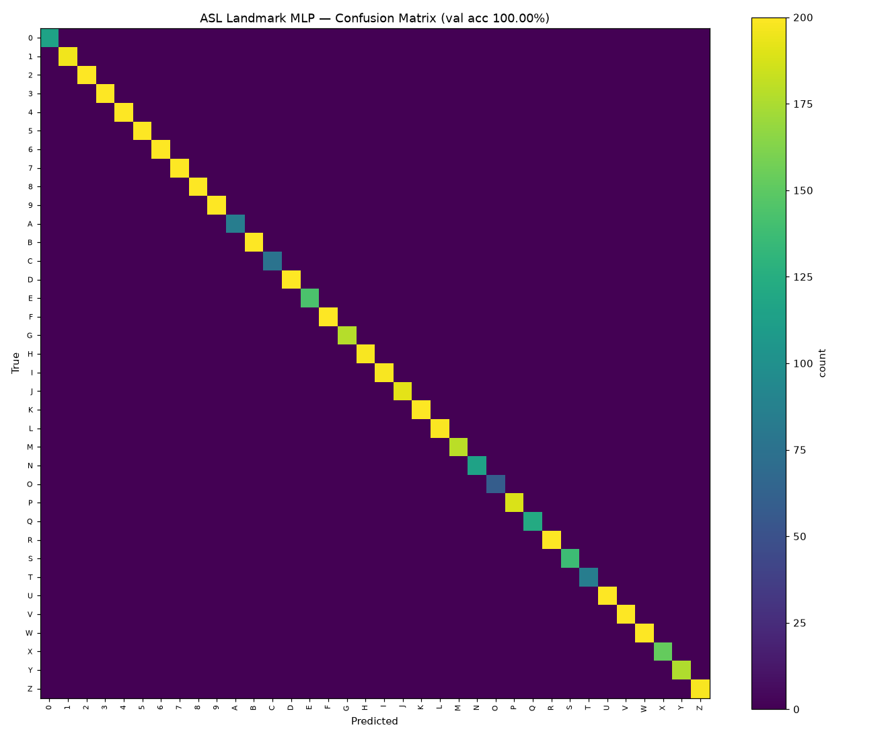
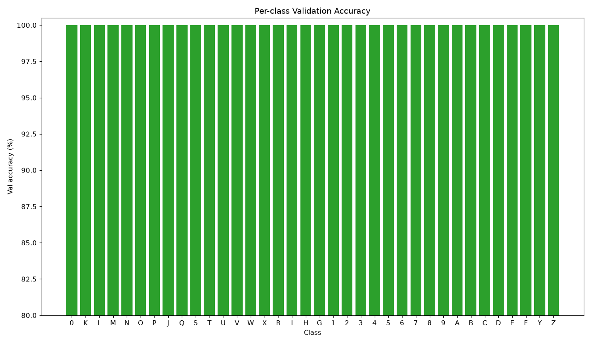
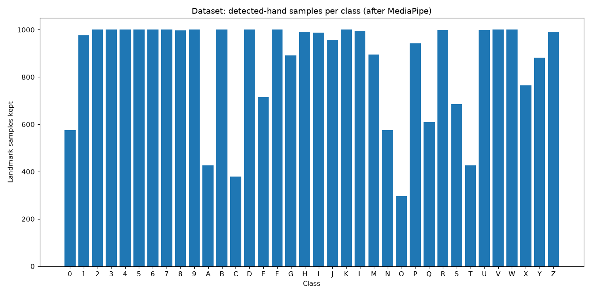

# ASL Landmark MLP — Hand Gesture Recognizer

Lightweight MLP that classifies **36 American Sign Language static gestures**
(letters **A–Z**, digits **0–9**) from **21 MediaPipe hand landmarks**, not raw
pixels. This makes it robust to background, lighting, and webcam distribution shift,
and fast enough for real-time CPU inference.

## Inputs / Outputs

- **Input:** `float32[1, 63]` — 21 hand landmarks `(x, y, z)` flattened.
  Normalize before inference: subtract wrist (landmark 0), then divide by the
  wrist→middle-finger-MCP distance `‖landmark9 − landmark0‖` (scale invariance).
- **Output:** `float32[1, 36]` logits. `argmax` → class index; map via
  `mlp_classes.json` (sorted `0-9`, `A-Z`). Apply softmax for confidence.

## Architecture

`Linear(63,256) → BatchNorm → ReLU → Dropout(0.3) → Linear(256,128) → BatchNorm →
ReLU → Dropout(0.2) → Linear(128,36)`

## Training

- Features extracted with MediaPipe HandLandmarker from the ASL-HG processed split.
- 30,962 landmark samples (images with no detected hand were skipped).
- AdamW (lr 1e-3), CosineAnnealingLR, 100 epochs, batch 256, stratified 80/20 split.
- **Validation accuracy: 100%** on 6,193 held-out landmark samples (macro per-class 100%).

## Results & Analysis

| Metric | Value |
|---|---|
| Validation accuracy | 100.00% |
| Macro per-class accuracy | 100.00% |
| Validation samples | 6,193 |
| Landmark samples (total) | 30,962 |





The confusion matrix is fully diagonal — the wrist-centered, scale-normalized
landmark representation makes the 36 classes near-linearly separable. Closed-fist
signs (`O`, `C`, `A`, `T`) contribute fewer samples because MediaPipe detects them
less often (see distribution).

## Usage

```python
import json, numpy as np, onnxruntime as ort

sess = ort.InferenceSession("mlp_asl.onnx", providers=["CPUExecutionProvider"])
classes = json.load(open("mlp_classes.json"))

def normalize(pts):
    pts = pts - pts[0]
    scale = np.linalg.norm(pts[9]) or 1.0
    return (pts / scale).reshape(1, -1).astype("float32")

logits = sess.run(None, {"input": normalize(landmarks_21x3)})[0][0]
pred = classes[str(int(logits.argmax()))]
```

Live webcam demo (Gradio): https://huggingface.co/spaces/nocontextdoruk/asl-recognizer

## Dataset & Credits

**Dataset:** ASL-HG — American Sign Language Hand Gesture Image Dataset.
Pranto et al. (2026), *Data in Brief*.
- Article: https://www.sciencedirect.com/science/article/pii/S2352340926000454
- Mendeley Data: https://data.mendeley.com/datasets/j4y5w2c8w9/1
- DOI: https://doi.org/10.17632/j4y5w2c8w9.1

**Model & App:** Doruk Doğular (nocontextdoruk).

## License

**CC BY-NC 4.0** — free for research, education, and personal/open projects with
attribution; no commercial or enterprise resale. Please cite if you use it. The
ASL-HG dataset is owned by its original authors (cite separately).
